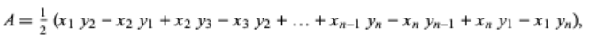
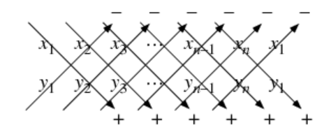

### 다각형의 범위 구하기
좌표의 순서는 시계 반향이든, 반 시계 반향이든 연결된 형태로 이루어져 있어야 합니다.



```
for (int i = 0; i < p; i++) {
  int j = (i + 1) % p;
  total += 1LL * points[i].first * points[j].second;
  total -= 1LL * points[j].first * points[i].second;
}
total /= 2;
```

### 두 점 사이의 거리
$$
\sqrt{(x_2 - x_1)^2 + (y_2 - y_1)^2}
$$

```
double Distance(pair<int, int>& p1, pair<int, int>& p2) {
  double distance;
  distance = sqrt(pow(p1.x - p2.x, 2) + pow(p1.y - p2.y, 2));
  return distance
}
```